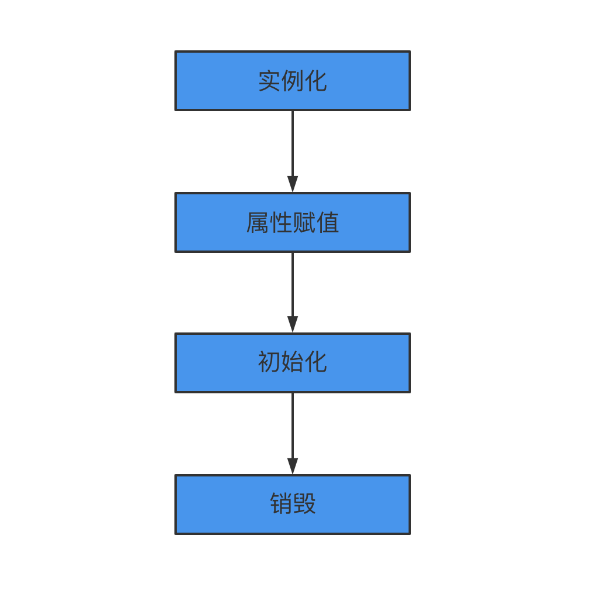
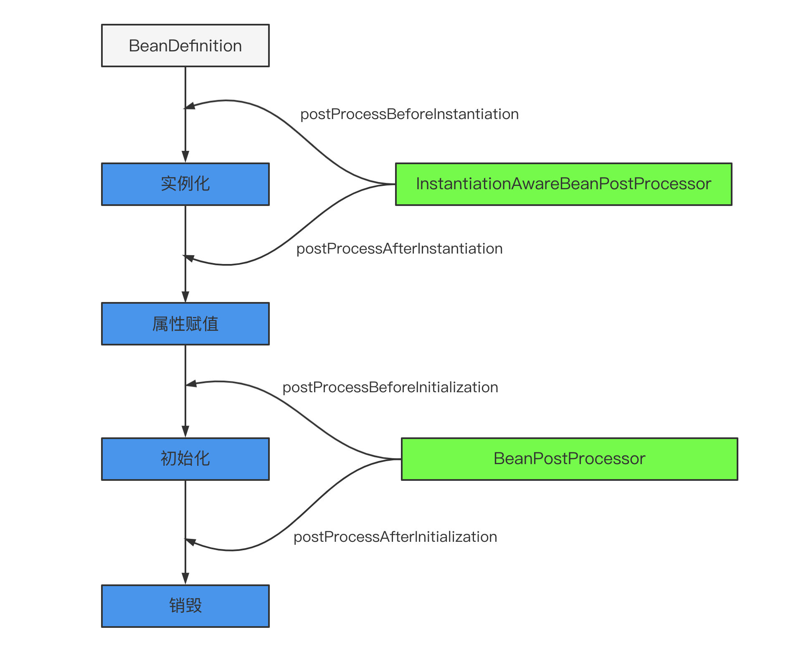
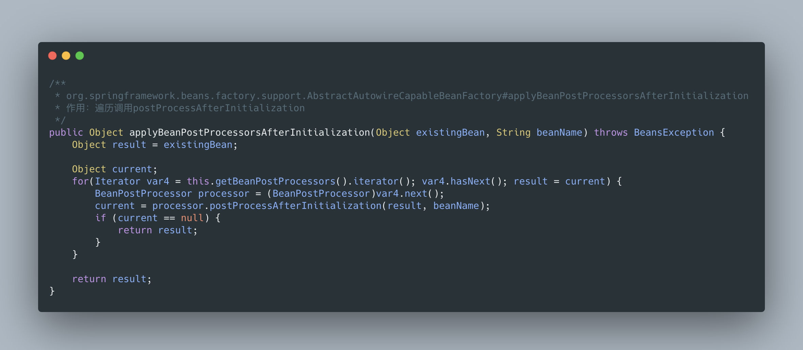

> Apollo动态配置其实本质就是利用Spring Bean 的生命周期的扩展点，这个扩展点超级多，不可能全部列出来，只说核心的扩展点。这也就是为什么 Spring 的扩展性很好的原因，开了很多的口子，尽可能让某个功能高内聚松耦合，用户需要哪个功能就用哪个，而不是直接来一个大而全的东西。

我们先通过学习核心的，然后后续对照Apollo用到了哪些再对照，就会发现很多地方就能理解的很好了

<!-- more -->

**什么是 Spring Bean 的生命周期**

对于普通的 Java 对象，当 new 的时候创建对象，然后该对象就能够使用了。一旦该对象不再被使用，则由 Java 自动进行垃圾回收。

而 Spring 中的对象是 bean，bean 和普通的 Java 对象没啥大的区别，只不过 Spring 不再自己去 new 对象了，而是由 IoC 容器去帮助我们实例化对象并且管理它，我们需要哪个对象，去问 IoC 容器要即可。IoC 其实就是解决对象之间的耦合问题，Spring Bean 的生命周期完全由容器控制。

## Spring Bean 的生命周期

这里要提一下，这里我们说的 Spring Bean 的生命周期主要指的是 singleton bean，对于 prototype 的 bean ，Spring 在创建好交给使用者之后则不会再管理后续的生命周期。

我们也来复习下 Spring 中的 bean 的作用域有哪些?

- `singleton` : 唯一 bean 实例，Spring 中的 bean 默认都是单例的。
- `prototype` : 每次请求都会创建一个新的 bean 实例。
- `request` : 每一次 HTTP 请求都会产生一个新的 bean，该 bean 仅在当前 HTTP request 内有效。
- `session` : 每一次 HTTP 请求都会产生一个新的 bean，该 bean 仅在当前 HTTP session 内有效。
- `global-session`： 全局 session 作用域，仅仅在基于 Portlet 的 web 应用中才有意义，Spring5 已经没有了。Portlet 是能够生成语义代码（例如：HTML）片段的小型 Java Web 插件。它们基于 portlet 容器，可以像 servlet 一样处理 HTTP 请求。但是，与 servlet 不同，每个 portlet 都有不同的会话。

我们知道对于普通的 Java 对象来说，它们的生命周期就是：

- 实例化
- 该对象不再被使用时通过垃圾回收机制进行回收

而对于 Spring Bean 的生命周期来说：

- 实例化 Instantiation
- 属性赋值 Populate
- 初始化 Initialization
- 销毁 Destruction

实例化 -> 属性赋值 -> 初始化 -> 销毁

只有四个步骤，这样拆解的话是不是感觉也不难？不像其他人写的那样直接一上来就各种 BeanPostProcessor、BeanFactoryPostProcessor 全部怼进流程里去，别说读者看着头大，自己写的可能短时间内还记得流程，隔个一段时间，你可能都不知道自己写了个啥。

通过 Bean 创建流程入口`AbstractApplicationContext#refresh()` 方法的 `finishBeanFactoryInitialization(beanFactory)` 处带大家跟一下源码，想了想还是不带入过多的代码进来，直接给到最终的主要逻辑。

```java
protected Object doCreateBean(String beanName, RootBeanDefinition mbd, @Nullable Object[] args) throws BeanCreationException {
    BeanWrapper instanceWrapper = null;
    if (mbd.isSingleton()) {
        instanceWrapper = (BeanWrapper)this.factoryBeanInstanceCache.remove(beanName);
    }
    if (instanceWrapper == null) {
    	// 实例化阶段
        instanceWrapper = this.createBeanInstance(beanName, mbd, args);
    }
    ...
    Object exposedObject = bean;

    try {
    	// 属性赋值阶段
        this.populateBean(beanName, mbd, instanceWrapper);
        // 初始化阶段
        exposedObject = this.initializeBean(beanName, exposedObject, mbd);
    } catch (Throwable var18) {
        ...
    }
    ...
}
```

至于销毁，是在容器关闭时调用的，详见 `ConfigurableApplicationContext#close()`

是不是很清爽了？至于 BeanPostProcessor、BeanFactoryPostProcessor 以及其他的类，只不过是对主流程四个步骤的一系列扩展点而已。

## Spring Bean 的生命周期的扩展点

Spring Bean 的生命周期的扩展点超级多，老周这里不可能全部列出来，只说核心的扩展点。这也就是为什么 Spring 的扩展性很好的原因，开了很多的口子，尽可能让某个功能高内聚松耦合，用户需要哪个功能就用哪个，而不是直接来一个大而全的东西。

**Bean 自身的方法**

比如构造函数、getter/setter 以及 init-method 和 destory-method 所指定的方法等，也就对应着上文说的实例化 -> 属性赋值 -> 初始化 -> 销毁四个阶段。



**容器级的方法（BeanPostProcessor 一系列接口）**

主要是后处理器方法，比如下图的 `InstantiationAwareBeanPostProcessor`、`BeanPostProcessor` 接口方法。这些接口的实现类是独立于 Bean 的，并且会注册到 Spring 容器中。在 Spring 容器创建任何 Bean 的时候，这些后处理器都会发生作用。



 **InstantiationAwareBeanPostProcessor 源码分析**

我们翻一下源码发现 InstantiationAwareBeanPostProcessor 是继承了 BeanPostProcessor


- `InstantiationAwareBeanPostProcessor#postProcessBeforeInstantiation` 调用点

> Object postProcessBeforeInstantiation(Class<?> beanClass, String beanName)
> 返回值：如果返回的不为null，那么后续的Bean的创建流程【实例化、初始化afterProperties】都不会执行，而是直接使用返回的快捷Bean，此时的正常执行顺序如下：
> InstantiationAwareBeanPostProcessor接口中的postProcessBeforeInstantiation，在实例化之前调用。
> BeanPostProcessor接口中的postProcessAfterInitialization，在实例化之后调用。




总之，postProcessBeforeInstantiation 在 doCreateBean 之前调用，也就是在 bean 实例化之前调用的，英文源码注释解释道该方法的返回值会替换原本的 Bean 作为代理，这也是 [AOP](https://so.csdn.net/so/search?q=AOP&spm=1001.2101.3001.7020) 等功能实现的关键点。

- `InstantiationAwareBeanPostProcessor#postProcessAfterInstantiation` 调用点

> boolean postProcessAfterInstantiation(Object bean, String beanName) throws BeansException
> 正常情况下在实例化之后在执行populateBean之前调用
> 返回值：如果有指定的bean的时候返回false，那么后续的属性填充和属性依赖注入【populateBean】将不会执行，同时后续的postProcessPropertyValues将不会执行,但是初始化和BeanPostProcessor的仍然会执行。


public PropertyValues postProcessPropertyValues(PropertyValues pvs, PropertyDescriptor[] pds, Object bean, String beanName)
实例化之后调用，在方法applyPropertyValues【属性填充】之前
返回值：如果返回null，那么将不会进行后续的属性填充，比如依赖注入等，如果返回的pvs额外的添加了属性，那么后续会填充到该类对应的属性中。
pvs：PropertyValues对象，用于封装指定类的对象，简单来说就是PropertyValue的集合，里面相当于以key-value形式存放类的属性和值。
pds：PropertyDescriptor对象数组，PropertyDescriptor相当于存储类的属性，不过可以调用set，get方法设置和获取对应属性的值。


**BeanPostProcessor 源码分析**

> org.springframework.beans.factory.support.AbstractAutowireCapableBeanFactory#doCreateBean


进入初始化接口：


我们先来看

> org.springframework.beans.factory.support.AbstractAutowireCapableBeanFactory#applyBeanPostProcessorsBeforeInitialization


- 首先获取到所有的后置处理器 getBeanPostProcessors()
- 在 for 循环中依次调用后置处理器的方法 `processor.postProcessBeforeInitialization(result, beanName);`
- 进入 postProcessBeforeInitialization 方法

> org.springframework.context.support.ApplicationContextAwareProcessor#postProcessBeforeInitialization


进入 `invokeAwareInterfaces(bean);` 方法，当前 bean 实现了 ApplicationContextAware 接口。


- `ApplicationContextAwareProcessor#postProcessBeforeInitialization` 首先判断此 bean 是不是各种的Aware，如果是它列举的那几个 Aware 就获取 Bean 工厂的权限，可以向容器中导入相关的上下文环境，目的是为了 Bean 实例能够获取到相关的上下文，如果不是它列举的几个 Aware，那就调用 `invokeAwareInterfaces(bean)`，向容器中添加相关接口的上下文环境。

**3.3 工厂后处理器方法（BeanFactoryProcessor 一系列接口）**

包括 `AspectJWeavingEnabler`、`CustomAutowireConfigurer`、`ConfigurationClassPostProcessor` 等。这些都是 Spring 框架中已经实现好的 BeanFactoryPostProcessor，用来实现某些特定的功能。

我们知道 Spring IoC 容器初始化的关键环节就在 `org.springframework.context.support.AbstractApplicationContext#refresh` 方法中 ，容器创建的主体流程都在这个方法里面，这个方法是真的重要！！！

对于工厂后处理器方法老周这里直接带你看 `invokeBeanFactoryPostProcessors(beanFactory);` 方法，这个方法处理的是 `BeanFactoryPostProcessor` 接口的 Bean。调用方法如下：


跟到最重要的方法里去，代码虽长，但逻辑中规中矩。

`BeanFactoryPostProcessor`：一切处理 BeanFactory 的父接口
`BeanDefinitionRegistryPostProcessor`：实现了 BeanFactoryPostProcessor 接口的接口


流程说明：

- 调用 BeanDefinitionRegistryPostProcessor#postProcessBeanDefinitionRegistry(registry) 方法。参数 beanFactoryPostProcessors 传入的优先处理掉。然后获取容器注册的，对于这些 Bean 按照 PriorityOrdered 接口、Ordered、没有排序接口的实例分别进行处理。
- 调用 BeanFactoryPostProcessor#postProcessBeanFactory(beanFactory) 方法。备注：BeanDefinitionRegistryPostProcessor 属于 BeanFactoryPostProcessor 子接口。先处理属于 BeanDefinitionRegistryPostProcessor 接口实例的 postProcessBeanFactory(beanFactory) 方法，然后获取容器注册的。对于这些 Bean 按照 PriorityOrdered 接口、Ordered、没有排序接口的实例分别进行处理。
