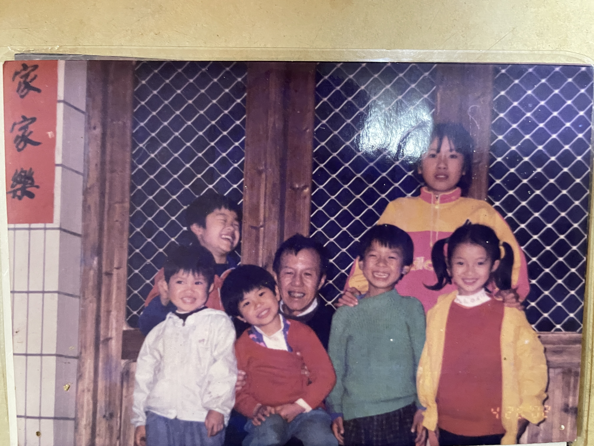
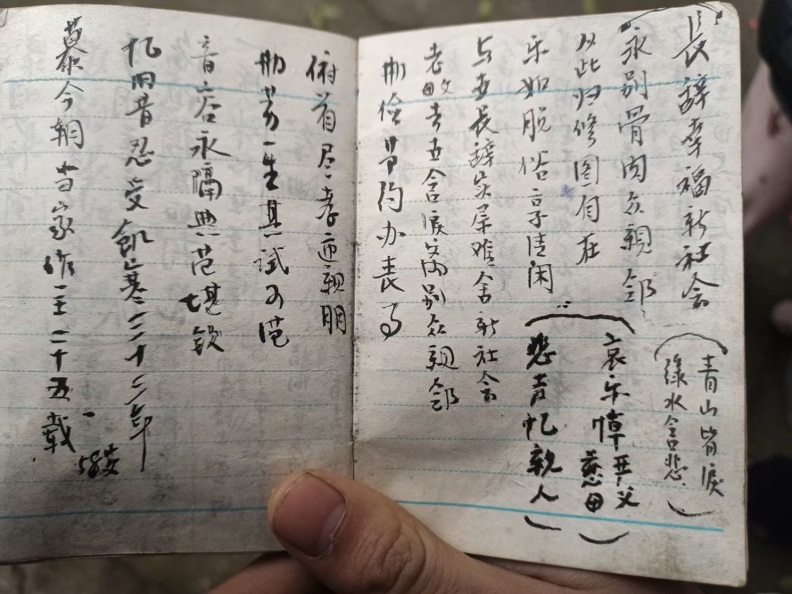

我的爷爷于2023年03月27日10:36分去世了。

<!-- more -->

#### 简要生平

我的爷爷，彭明辉，出生于1938年，享年85岁。在我爸的悼念中写道：

> 父亲大人出生于1938年5月14日贫农家庭，高小文化，1954年起参加潭湾初级社，六联乡高级社，横烟大队的基层工作，
>
> 
>
> 1956年7月加入中国共产党，在党和政府的培养下，加强学习，得到了领导的推荐，进入人民公社，乡人民政府从事民政、企业会计(助理会计师职称)等职务工作,
>
> 
>
> 在几十年的工作中，勤奋努力、兢兢业业、任劳任怨，奉献自己力量，教子有方，儿孙绕膝，一生精力全部奉献给后裔，
>
> 
>
> 严父因年迈突发重病，经多方医治无效，不幸于本闰二月初六日，上午10.36时分寿终正寝，享寿85年，生前感谢亲友族的亲切关怀，在此我表示深深哀谢！

而我们在整理遗物时，找回了很多年前的回忆，也看到他的意气风发！

#### 我们的回忆

小时候，我们一群孙辈环绕在他身旁，那时候他应该是很幸福

但是这些记忆直到我们找到照片也记不起，此时我们就像生活在两个平行空间，没有记忆的交集

相信他也曾无数次翻开这些充满他回忆的照片，也会情不自禁的笑出来

#### 他的意气风发

从他收藏学习生活材料记录来看，他年轻时也是一个爱学习、万事皆计划、喜爱记录、善于整理、非常细心的一个帅气年轻小伙

记录的家庭成员的生辰八字

写的悼词

种种的点点滴滴，和我们看到的爷爷完全是两个类型的人，此时他如此细腻、如此多愁善感、如此耐心

此时，不觉令人发醒：人终归黄土，而如何让人长久活在大家记忆之中？

我觉无非就是他给这个世界留下了什么！

<iframe height=498 width=510 style="width: 100%;" src="20230328/1.mp4"></iframe>

从前
您带我们扫墓烧钱，
您教我们叩头作揖，
您教我们写您的祖考
您给我们讲述您的辉煌故事

以后
我们给您扫墓烧钱，
我们给您叩头作揖，
您变成了我们的祖考
我们只能从仅存照片中回忆您的故事

您长眠，我常念；爷爷，一路走好！

视频制作By彭丽娜